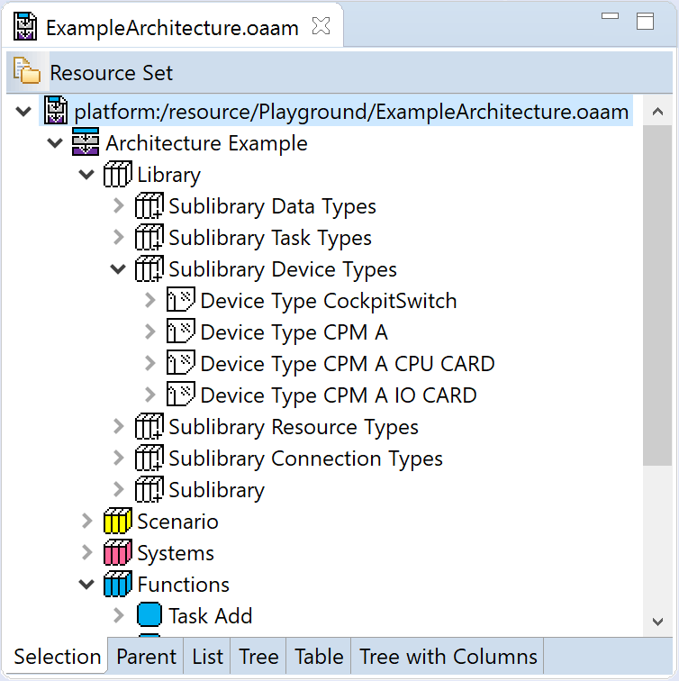

# OAAM - Open Avionics Architecture Model

OAAM is an open source domain specific model for describing modern avionics architectures including Integrated Modular Avionics (IMA). It is intended for planning, optimizing and comparing multiple large scale avionics architectures. It offers a rigid resource and constraint model. Moreover, it is intended to be the system description language and avionics platform’s consciousness of future configurations-less self-organizing avionics systems, so called adaptive or autonomic platforms.

The model is organized in nine layers.

* Library: Common and reusable definitions as data, task, hardware, and signal types.
* Scenarios: Architecture wide properties, as well as variants and operation mode definitions.
* Systems: High-level and not executable description of systems including physical informations.
* Functions: An executable function description, including tasks and data flows.
* Hardware: The hardware topology of devices and connections. 
* Anatomy: The spatial topology of installation locations and cable routes.
* Capabilities: Definition of software to hardware to anatomy assignment possibilities and resource consumptions.
* Restrictions: Constraints on system functions including the presented safety and timing restrictions.
* Allocations: The assignment of tasks functions to hardware and hardware to anatomy.

The model is based on the Eclipse Modeling Project (EMF).

## Getting Started

Import the model, edit, and editor plugin in your local Eclipse instance. The model can browsed by opening the *oaam.aird* file with the Eclipse Ecore Diagram Editor. To work with the model a new Eclipse instance must be opened including the model, edit, and editor plug-in.

### Prerequisites

Eclipse Modeling Tools 4.6

or
 
Eclipse 4.6 including Eclipse EMF
and optionally Ecore Diagram Editor for graphical EMF editing 

### Installing

1. Clone git repository to local hard drive 
2. Add existing local repository to Eclipse (EGIT perspective)
3. Right click on the repository and select “Import projects”
4. Work with the model by opening de.oaam.model/model/oaam.aird or oaam.ecore
5. Start a new Eclipse instance with the three following plug-ins enabled:
    * de.oaam.model
    * de.oaam.model.edit
    * de.oaam.model.editor

6. Create a new OAAD model from the context menu of the project explorer (New -> Other -> Open Avionics Architecture Model -> OAAD Model)
7. Find an example architecture in de.oaam.model.examples. Copy it in the newly started Eclipse instance and open it by double click to work with the model.

## Built With

* [Eclipse](http://www.eclipse.org/)
* [Eclipse Modeling Framework (EMF)](https://eclipse.org/modeling/emf/)
* [Ecore Diagram Editor](http://www.eclipse.org/ecoretools/overview.html)

## Versioning

We use [SemVer](http://semver.org/) for versioning. For the versions available, see the [tags on this repository](https://github.com/ComplexAvionicsSystems/OAAM/tags). 

## Authors

* **Bjoern Annighoefer** - *Model creation* - [Institute on Aircraft Systems – University of Stuttgart](http://www.ils.uni-stuttgart.de/mitarbeiter/annighoefer.html)

See also the list of [contributors](https://github.com/ComplexAvionicsSystems/OAAM/contributors) who participated in this project.

## License

This project is licensed under the Eclipse Public License 1.0 - see the [LICENSE.md](LICENSE.md) file for details.

